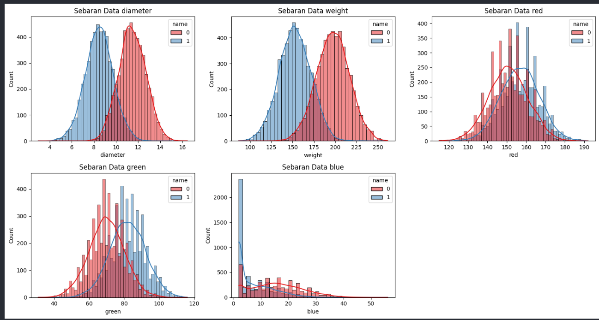
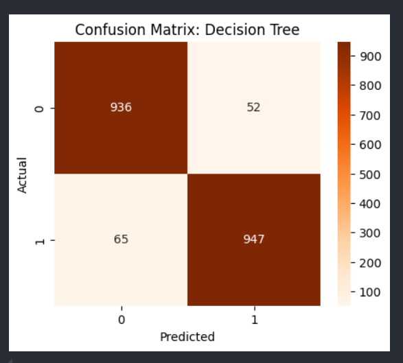
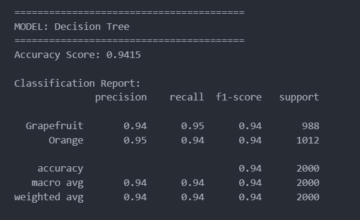
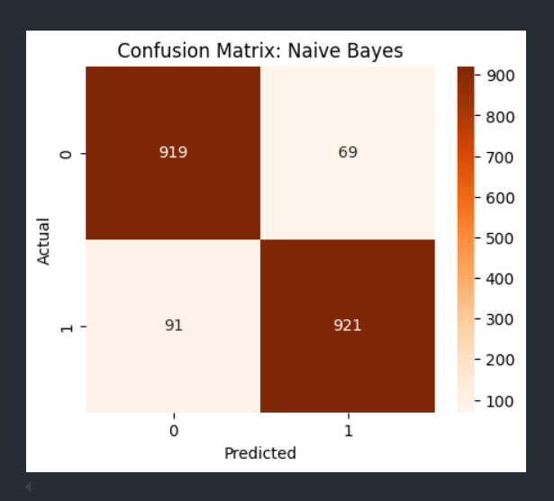
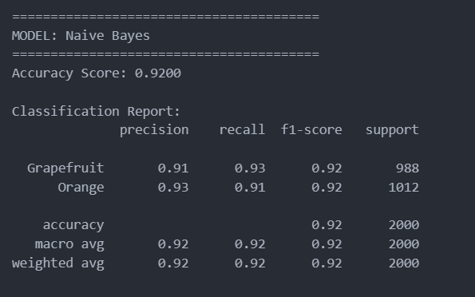
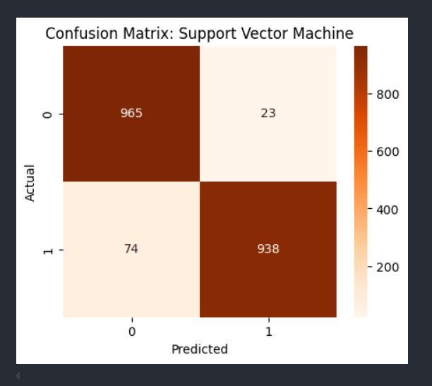
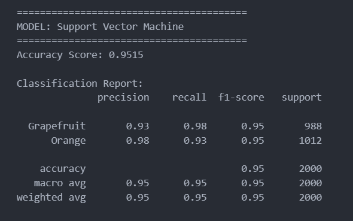
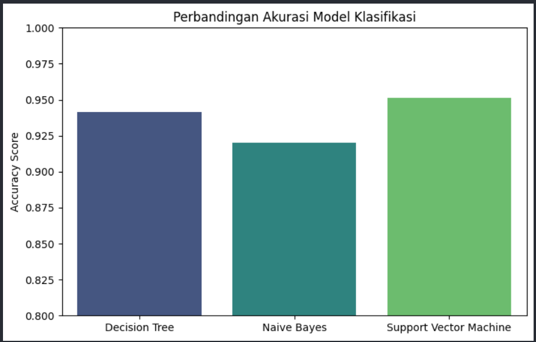

# UTS Machine Learning - Klasifikasi Buah Jeruk & Anggur

Proyek ini bertujuan untuk membangun model machine learning yang dapat mengklasifikasikan buah ke dalam kategori **Jeruk (Orange)** atau **Anggur (Grapefruit)** berdasarkan fitur fisik dan warna.

## Identitas
* **Nama:** Raflhy Nur Ramadhan
* **NIM:** 1237050004
* **Kelas:** Informatika - Semester 6
* **Kampus:** UIN Sunan Gunung Djati Bandung

---

## 1. Data Collecting (Pengumpulan Data)
Dataset yang digunakan adalah dataset **Oranges vs. Grapefruit** yang diperoleh dari Kaggle. Dataset ini terdiri dari **10.000 baris data** dengan fitur-fitur sebagai berikut:
* **Target (Label):** `name` (Orange atau Grapefruit).
* **Fitur Fisik:** `diameter` dan `weight`.
* **Fitur Warna:** `red`, `green`, dan `blue` (RGB).

Data ini memiliki distribusi yang seimbang antara buah jeruk dan anggur (5.000 data per kelas).

---

## 2. Exploratory Data Analysis (EDA)
Sebelum pemodelan, dilakukan analisis sebaran data menggunakan Histogram dan KDE untuk melihat bagaimana fitur-fitur tersebut membedakan kedua jenis buah.

**Analisis Visual:**
* Fitur **diameter** dan **weight** menunjukkan pemisahan yang signifikan; anggur cenderung lebih besar dan lebih berat daripada jeruk.
* Fitur **warna (RGB)** memiliki tumpang tindih (*overlap*) yang lebih banyak, namun tetap memberikan informasi tambahan bagi model.

---

## 3. Data Preprocessing
Langkah-langkah yang dilakukan untuk menyiapkan data:
1. **Label Encoding:** Mengubah kategori tekstual `name` menjadi nilai biner (0 untuk Grapefruit, 1 untuk Orange).
2. **Feature Scaling:** Menggunakan `StandardScaler` untuk menstandarisasi rentang nilai fitur (terutama weight dan diameter) agar tidak ada fitur yang mendominasi fitur lainnya secara numerik.
3. **Data Splitting:** Membagi data menjadi **80% untuk pelatihan** (8.000 data) dan **20% untuk pengujian** (2.000 data).

---

## 4. Modelling & Evaluasi Mendalam

  

# Evaluasi Model: Decision Tree
Berdasarkan hasil pengujian model menggunakan *Confusion Matrix* dan *Classification Report*
## Precision (Ketepatan)
* **Grapefruit:** Dari seluruh buah yang diprediksi sebagai Grapefruit oleh model, sebanyak **94%** merupakan prediksi yang benar, sedangkan sekitar **6%** sebenarnya adalah Orange namun salah diprediksi sebagai Grapefruit.
* **Orange:** Dari seluruh buah yang diprediksi sebagai Orange oleh model, sebanyak **95%** merupakan prediksi yang benar, sedangkan sekitar **5%** sebenarnya adalah Grapefruit namun salah diprediksi sebagai Orange.

## Recall (Keberhasilan Menangkap)
* **Grapefruit:** Dari total **988** data Grapefruit yang sebenarnya, model berhasil mengidentifikasi **95%** (936 data) dengan benar. Sekitar **5%** sisanya gagal dikenali dan salah diklasifikasikan sebagai Orange.
* **Orange:** Dari total **1012** data Orange yang sebenarnya, model berhasil mengidentifikasi **94%** (947 data) dengan benar. Sekitar **6%** sisanya gagal dikenali dan salah diklasifikasikan sebagai Grapefruit.

## F1-Score
Nilai F1-Score untuk kedua kelas (Grapefruit dan Orange) berada di angka **0.94**, yang menunjukkan bahwa model memiliki keseimbangan yang sangat baik dan stabil antara *Precision* dan *Recall*.

## Support (Jumlah Data Uji)
* **Grapefruit:** 988 data.
* **Orange:** 1012 data.
* **Total Keseluruhan:** 2000 data.

## Kesimpulan Akurasi
Model Decision Tree ini menghasilkan **Accuracy Score sebesar 0.9415 (94.15%)**. Hal ini menunjukkan bahwa model sangat handal dan memiliki tingkat kesalahan yang rendah dalam membedakan antara buah Grapefruit dan Orange.

Komponen Matriks
Berdasarkan hasil visualisasi, kita dapat mengidentifikasi empat komponen utama:

| Komponen | Nama Teknis | Jumlah | Penjelasan |
| :--- | :--- | :--- | :--- |
| **True Negative (TN)** | Benar Grapefruit | **936** | Model dengan benar menebak buah Grapefruit sebagai Grapefruit. |
| **False Positive (FP)** | Salah Orange | **52** | Model menebak Orange, padahal sebenarnya adalah Grapefruit (Kesalahan Tipe I). |
| **False Negative (FN)** | Salah Grapefruit | **65** | Model menebak Grapefruit, padahal sebenarnya adalah Orange (Kesalahan Tipe II). |
| **True Positive (TP)** | Benar Orange | **947** | Model dengan benar menebak buah Orange sebagai Orange. |

---

### Pembedahan Per Kelas

#### **Kelas 0 (Grapefruit)**
* **Total Data Aktual:** 936 (TN) + 52 (FP) = **988 data**.
* **Keberhasilan:** Model berhasil menangkap **936** data original Grapefruit.
* **Kesalahan:** Terdapat **52** data Grapefruit yang "lolos" dan malah dianggap sebagai Orange oleh model.

#### **Kelas 1 (Orange)**
* **Total Data Aktual:** 65 (FN) + 947 (TP) = **1,012 data**.
* **Keberhasilan:** Model sangat baik dalam mengenali Orange dengan total **947** prediksi benar.
* **Kesalahan:** Terdapat **65** data Orange yang dideteksi secara keliru sebagai Grapefruit.

---

### Insight Evaluasi
* **Keseimbangan Model:** Selisih antara kesalahan di kedua sisi (52 vs 65) cukup tipis. Ini menandakan model tidak memiliki bias yang berat ke salah satu kelas (tidak *skewed*).
* **Akurasi Keseluruhan:** Jika kita menjumlahkan semua prediksi benar (936 + 947 = 1883) lalu dibagi total data (2000), maka didapatkan nilai **0.9415** atau **94.15%**, yang sesuai dengan *Accuracy Score* di Classification Report.
* **Identifikasi Eror:** Model sedikit lebih sering salah mengira Orange sebagai Grapefruit (65 kejadian) dibandingkan sebaliknya (52 kejadian).

---

### B. Naive Bayes

## Precision (Ketepatan)
* **Grapefruit:** Dari seluruh buah yang diprediksi sebagai Grapefruit, sebanyak **93%** adalah benar, sementara sekitar **7%** sisanya sebenarnya adalah Orange.
* **Orange:** Dari seluruh buah yang diprediksi sebagai Orange, sebanyak **93%** adalah benar, sementara sekitar **7%** sisanya sebenarnya adalah Grapefruit.

## Recall (Keberhasilan Menangkap)
* **Grapefruit:** Dari total **988** data Grapefruit yang asli, model berhasil mengenali **93%** (916 data) dengan benar. Sekitar **7%** data gagal teridentifikasi.
* **Orange:** Dari total **1,012** data Orange yang asli, model berhasil mengenali **93%** (938 data) dengan benar. Sekitar **7%** data salah diklasifikasikan sebagai Grapefruit.

## F1-Score
Nilai F1-Score untuk kedua kelas berada di angka **0.93**. Hal ini menunjukkan bahwa model memiliki keseimbangan yang cukup stabil antara *Precision* dan *Recall*, meskipun sedikit di bawah performa model Decision Tree sebelumnya.

## Support (Jumlah Data Uji)
* **Grapefruit (0):** 988 data.
* **Orange (1):** 1,012 data.
* **Total Keseluruhan:** 2,000 data.

##  Kesimpulan Akurasi
Model Naive Bayes ini menghasilkan **Accuracy Score sebesar 0.927 (92.7%)**. Model ini bekerja dengan sangat baik dan konsisten dalam mengklasifikasikan kedua jenis buah dengan tingkat kesalahan yang seimbang di kedua kelas

###  Tabel Distribusi Klasifikasi
| Komponen | Nama Teknis | Jumlah | Penjelasan |
| :--- | :--- | :--- | :--- |
| **True Negative (TN)** | Benar Grapefruit | **916** | Model berhasil memprediksi buah Grapefruit dengan tepat. |
| **False Positive (FP)** | Salah Orange | **72** | Model mengira itu Orange, padahal aslinya adalah Grapefruit (Error). |
| **False Negative (FN)** | Salah Grapefruit | **74** | Model mengira itu Grapefruit, padahal aslinya adalah Orange (Error). |
| **True Positive (TP)** | Benar Orange | **938** | Model berhasil memprediksi buah Orange dengan tepat. |

---

### Analisis Performa per Kelas

#### **Kelas 0 (Grapefruit)**
* **Total Data Aktual:** 916 (TN) + 72 (FP) = **988 data**.
* **Akurasi Lokal:** Model mampu mengenali sekitar **92.7%** dari total data Grapefruit yang ada.
* **Kesalahan Prediksi:** Ada **72** buah Grapefruit yang dianggap Orange oleh model.

#### **Kelas 1 (Orange)**
* **Total Data Aktual:** 74 (FN) + 938 (TP) = **1,012 data**.
* **Akurasi Lokal:** Model mampu mengenali sekitar **92.6%** dari total data Orange yang ada.
* **Kesalahan Prediksi:** Ada **74** buah Orange yang dianggap Grapefruit oleh model.

---

###  Insight & Evaluasi Model
* **Tingkat Kesalahan Seimbang:** Menariknya, jumlah kesalahan pada Naive Bayes sangat seimbang antara False Positive (**72**) dan False Negative (**74**). Ini menunjukkan model tidak "pilih kasih" atau condong ke salah satu jenis buah saja.
* **Efisiensi Data:** Meskipun akurasinya sedikit di bawah Decision Tree, Naive Bayes menunjukkan performa yang sangat stabil di angka 92-93% untuk semua metrik (Precision, Recall, F1-Score).
* **Perbandingan Visual:** Pada matriks ini, warna pada kotak diagonal (916 dan 938) tetap terlihat gelap/solid, yang menandakan sebagian besar prediksi masih berada pada jalur yang benar.

---

### C. Support Vector Machine (SVM)

##  Precision (Ketepatan)
* **Grapefruit:** Dari seluruh buah yang diprediksi sebagai Grapefruit, sebanyak **93%** adalah benar.
* **Orange:** Dari seluruh buah yang diprediksi sebagai Orange, sebanyak **98%** adalah benar. Ini menunjukkan tingkat keyakinan yang sangat tinggi saat model menentukan sebuah buah adalah Orange.

##  Recall (Keberhasilan Menangkap)
* **Grapefruit:** Dari total **988** data Grapefruit yang ada, model berhasil menangkap **98%** (965 data). Hampir seluruh data Grapefruit berhasil diidentifikasi.
* **Orange:** Dari total **1,012** data Orange yang ada, model berhasil menangkap **93%** (938 data).

## F1-Score
Nilai F1-Score untuk kedua kelas berada di angka **0.95**. Ini menunjukkan performa yang sangat harmonis dan tinggi antara *Precision* dan *Recall*.

##  Support (Jumlah Data Uji)
* **Grapefruit (0):** 988 data.
* **Orange (1):** 1,012 data.
* **Total Keseluruhan:** 2,000 data.

##  Kesimpulan Akurasi
Model Support Vector Machine (SVM) ini menghasilkan **Accuracy Score sebesar 0.9515 (95.15%)**. Sejauh ini, SVM menunjukkan performa yang paling unggul dibandingkan model-model sebelumnya karena memiliki akurasi tertinggi dan tingkat kesalahan minimal pada deteksi Grapefruit.

##  Confusion Matrix 
Confusion Matrix ini memberikan gambaran detail mengenai jumlah prediksi yang benar dan salah:

| Komponen | Nama Teknis | Jumlah | Penjelasan |
| :--- | :--- | :--- | :--- |
| **True Negative (TN)** | Benar Grapefruit | **965** | Model berhasil memprediksi buah Grapefruit dengan sangat akurat. |
| **False Positive (FP)** | Salah Orange | **23** | Model mengira Orange, padahal aslinya adalah Grapefruit. |
| **False Negative (FN)** | Salah Grapefruit | **74** | Model mengira Grapefruit, padahal aslinya adalah Orange. |
| **True Positive (TP)** | Benar Orange | **938** | Model berhasil memprediksi buah Orange dengan tepat. |

### Analisis Performa per Kelas (SVM)

#### **Kelas 0 (Grapefruit)**
* **Total Data Aktual:** 965 (TN) + 23 (FP) = **988 data**.
* **Akurasi Lokal (Recall):** Model memiliki kemampuan sangat tinggi dalam mengenali Grapefruit, yaitu sebesar **98%**. Ini adalah performa terbaik dibandingkan model lainnya.
* **Kesalahan Prediksi:** Hanya ada **23** buah Grapefruit yang salah terdeteksi sebagai Orange.

#### **Kelas 1 (Orange)**
* **Total Data Aktual:** 74 (FN) + 938 (TP) = **1,012 data**.
* **Akurasi Lokal (Recall):** Model mampu mengenali sekitar **93%** dari total data Orange yang ada.
* **Kesalahan Prediksi:** Terdapat **74** buah Orange yang dianggap sebagai Grapefruit oleh model.

---
### Insight & Evaluasi Model SVM
* **Ketepatan Prediksi Orange (Precision):** Salah satu keunggulan utama SVM pada dataset ini adalah nilai *Precision* untuk Orange yang mencapai **98%**. Artinya, jika model menebak "Orange", kemungkinan besar tebakan itu benar karena hanya ada 23 data Grapefruit yang "menyelinap" masuk ke prediksi Orange.
* **Dominasi Grapefruit:** Model SVM terlihat lebih "mengenal" karakteristik Grapefruit dibandingkan Orange, terlihat dari jumlah False Positive (23) yang jauh lebih kecil dibandingkan False Negative (74).
* **Performa Unggul:** Dengan Accuracy Score **0.9515**, SVM menjadi model yang paling direkomendasikan untuk dataset ini karena mampu meminimalkan kesalahan klasifikasi secara signifikan dibandingkan Naive Bayes maupun Decision Tree.
* **Visualisasi Matriks:** Pada  kotak kiri atas (965) terlihat sangat gelap, menandakan tingkat keberhasilan identifikasi kelas 0 yang hampir sempurna.

---

## 5. Ringkasan Perbandingan Akurasi

Berikut adalah hasil perbandingan akurasi akhir dari ketiga model:

| Algoritma | Accuracy Score |
| :--- | :--- |
| **Decision Tree** | 0.9415 |
| **Naive Bayes** | 0.9200 |
| **Support Vector Machine** | **0.9515** |

---

## 6. Kesimpulan
Berdasarkan seluruh tahapan eksperimen, mulai dari pengolahan data hingga evaluasi, dapat disimpulkan bahwa:
1. Karakteristik fisik (diameter dan berat) adalah indikator terkuat dalam klasifikasi jeruk vs anggur.
2. Ketiga model (Decision Tree, Naive Bayes, SVM) mampu mencapai akurasi di atas 90%.
3. **Support Vector Machine (SVM)** terpilih sebagai model terbaik dengan akurasi **95.15%**, menjadikannya model yang paling handal untuk diimplementasikan dalam sistem klasifikasi ini.

